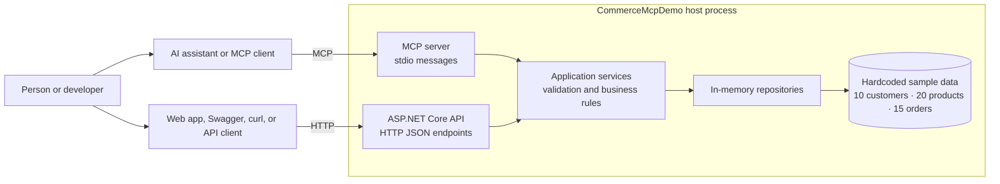
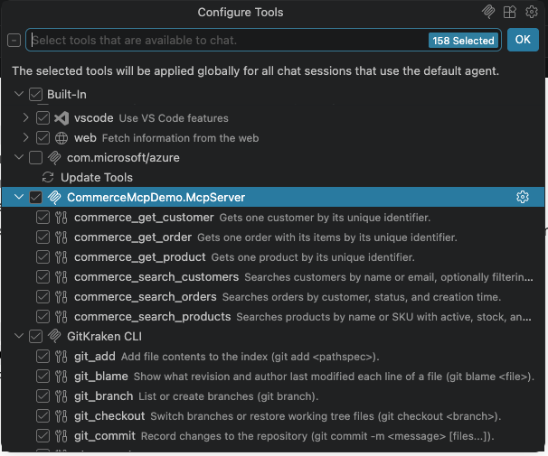

# 🤖 AI-Ready .NET Services with MCP

> A practical .NET 10 MCP server starter for exposing application capabilities to AI assistants.

This repository demonstrates how to connect an existing .NET service to an AI client using the Model Context Protocol (MCP). It uses a small commerce domain only as a relatable example: customers, products, and orders are the sample vocabulary, while the reusable idea is the .NET architecture around them.

The result is one set of business rules with two front doors:

- 🌐 ASP.NET Core HTTP/JSON endpoints for applications, Swagger, scripts, and users.
- 🧩 An MCP server for AI assistants such as GitHub Copilot in VS Code.

An AI assistant does not need to know your database schema or call private classes directly. It sees safe, named tools with descriptions and input schemas, then asks your application to perform the work through the same services your existing API already uses.

> **✨ Demo note**
> `CommerceMcpDemo` is the sample domain, not the product name or the main architectural idea. This is a learning project, not a production storefront. There is no database: the catalog is loaded from deterministic sample data when a host starts. Changes made through `POST` requests last only until that host process stops.

## 🎯 What this gives .NET developers

MCP provides a standard bridge between an AI assistant and the capabilities your application already owns. It does not replace your API, domain model, service layer, authentication, validation, or persistence. It gives an AI client a discoverable way to ask for selected operations.

That means you can make a service AI-ready without rebuilding it around a chatbot:

| Existing .NET asset | MCP-ready extension |
| --- | --- |
| Application service such as `IProductService` | A tool adapter that calls the service interface |
| Request and response DTOs | Tool input schemas and structured results |
| Validation and domain rules | The same rules applied to AI-initiated requests |
| API and integration tests | Tool dispatch and contract tests |
| Existing logs and error handling | Safe client-facing tool errors without leaking internals |

The commerce code is deliberately ordinary. That is the point: if your service already has clear application boundaries, it can usually gain an AI-facing interface without moving business logic into the MCP layer.

## 🧭 A quick tour of the sample

| Area | What it lets you do | A natural-language example |
| --- | --- | --- |
| 👤 Customers | Find one customer, search by name or email, and filter by active status | “Find active customers whose name contains `an`.” |
| 🛒 Products | Find one product, search by name or SKU, and filter by stock, status, or price | “Show active products in stock under 50.” |
| 📦 Orders | Find one order, or search by customer, status, or creation date | “Show the five newest confirmed orders.” |

The HTTP API also supports creating a customer and creating a draft order. These write actions are intentionally temporary and are not exposed as MCP tools in this demo.

## 🏗️ Architecture: one .NET core, two ways in

The diagram follows a request from a person or AI assistant to the sample data underneath it. The important design choice is shared responsibility: the API and MCP layers are different entry points, but the application layer owns the decisions about what is valid.



### 💬 The story behind the arrows

1. A person asks an AI assistant a commerce question, or an application sends an HTTP request.
2. The MCP server or API receives the request and passes it to the shared application layer.
3. The application layer checks the inputs, applies the rules, and asks the repositories for data.
4. The repositories read the local sample catalog and return a structured answer.

The combined MCP host also exposes the HTTP API on port `5057` by default. `scripts/start-api.sh` starts a separate HTTP-only process for API development; that process has its own in-memory copy of the sample data. Separate processes cannot share their in-memory changes.

## 🔄 How MCP works in this implementation

MCP is a protocol for giving an AI client structured access to tools and other application capabilities. In this sample, the conversation looks like this:

1. **Discover:** the AI client connects to the server and asks which tools are available.
2. **Describe:** the server returns each tool's name, purpose, and JSON input schema from [`tools.json`](src/CommerceMcpDemo.McpServer/tools.json).
3. **Choose:** the AI interprets a user's request and selects the relevant tool, such as `commerce_search_products`.
4. **Call:** the client sends the tool name and arguments over the MCP stdio connection.
5. **Validate:** the C# dispatcher checks that the tool is allowlisted and parses the arguments safely.
6. **Execute:** the adapter calls an application-service interface such as `IProductService`.
7. **Respond:** the service result is returned as structured JSON for the AI client to explain to the user.

MCP is the communication contract; your application services remain the source of truth. In this project, `CommerceTools` is the thin translation layer between MCP messages and the existing application services. `tools.json` describes the public tool surface, while the C# dispatcher controls what can actually execute.

### 🧠 Why tools are better than exposing internals

A well-designed MCP tool is a small, purposeful capability such as “search products under a maximum price.” It is easier for an AI model to discover and use than a broad method with hidden assumptions. Tool schemas also make the boundary explicit: inputs are typed, outputs are structured, and expected errors can be presented safely.

The same principle applies beyond commerce. Useful tools might be `find_invoice`, `check_support_ticket`, `create_calendar_draft`, or `summarize_project_status`. The domain changes; the adapter pattern stays familiar to .NET developers.

## 🛠️ A path from existing .NET service to AI-ready capability

If you already have a layered .NET application, the migration can be incremental:

1. **Choose a user task.** Start with a narrow operation that is useful in a conversation and safe to expose.
2. **Reuse the application layer.** Call an existing service interface rather than duplicating business rules in a controller or MCP handler.
3. **Design the tool contract.** Give the tool a clear name, a concise description, required fields, optional filters, and sensible limits.
4. **Keep safety at the boundary.** Validate identifiers, ranges, enums, permissions, and write operations before they reach infrastructure.
5. **Return structured results.** Let the AI explain a DTO or result object instead of parsing display text.
6. **Test the conversation boundary.** Verify discovery, valid calls, missing or invalid arguments, not-found results, and unexpected failures.
7. **Add observability and authorization.** In a real service, apply the same identity, audit, rate-limit, and logging policies used by your other entry points.

This sample starts with read-only tools because read operations are a useful first step. Writes can be added when their approval, authorization, and confirmation experience is clear.

## 🚀 Quick start: run the .NET MCP server

### 1. 🧰 Install the essentials

Install the .NET SDK version pinned by [`global.json`](global.json): .NET SDK `10.0.302`.

On macOS, use the Arm64 SDK on Apple Silicon or the x64 SDK on Intel. Git and an editor with C# support are useful for development. If this repository contains a local SDK at `.dotnet/dotnet`, the included scripts use it automatically.

### 2. 🧪 Build and test the whole story

From the repository root:

```bash
./.dotnet/dotnet restore CommerceMcpDemo.slnx
./.dotnet/dotnet build CommerceMcpDemo.slnx --no-restore
./.dotnet/dotnet test CommerceMcpDemo.slnx --no-build
```

If .NET is installed system-wide, use `dotnet` instead of `./.dotnet/dotnet`. The one-command verification script performs all three steps:

```bash
scripts/verify.sh
```

### 3. 🌐 Open the HTTP window

```bash
scripts/start-api.sh
```

The API listens on the URL configured by the project, normally `http://localhost:5000` or `https://localhost:5001` when launched with the .NET tooling. Use the terminal output for the exact URL.

Useful API pages:

- 🧭 Swagger UI: `/swagger`
- 📄 OpenAPI document: `/openapi/v1.json`
- 🔗 Swagger JSON: `/swagger/v1/swagger.json`
- 👤 Customers: `/api/customers`
- 🛒 Products: `/api/products`
- 📦 Orders: `/api/orders`

For example, once the API is running:

```bash
curl http://localhost:5000/api/products
curl http://localhost:5000/api/products/10000000-0000-0000-0000-000000000001
curl 'http://localhost:5000/api/products?inStock=true&maxPrice=50'
```

Use the actual listening URL printed by the application if it differs from `http://localhost:5000`.

### 4. 🤖 Give an AI assistant a seat at the counter

The workspace configuration in [`.vscode/mcp.json`](.vscode/mcp.json) already points to `scripts/start-mcp.sh`.

1. Open this repository in VS Code.
2. Allow VS Code/Copilot to load the configured `commerceDemo` MCP server.
3. Refresh the available MCP tools after changing the server or `tools.json`.
4. Ask questions such as:

   - “Find active customers whose name or email contains `an`.”
   - “Show in-stock active products under 50.”
   - “Get order `20000000-0000-0000-0000-000000000001`.”

The MCP protocol uses standard input/output (stdio). Protocol messages must remain on stdout, so build and application logs are sent to stderr. This is important for reliable communication with the AI client.

## 🤖 The AI-facing layer: MCP tools

The enabled tools are defined in [`src/CommerceMcpDemo.McpServer/tools.json`](src/CommerceMcpDemo.McpServer/tools.json). Together they give an AI assistant a carefully bounded, read-only view of the catalog:

| Tool | What it answers | Main inputs |
| --- | --- | --- |
| `commerce_get_customer` | “Who is this customer?” | `customerId` |
| `commerce_search_customers` | “Which customers match this?” | `query`, `status`, `page`, `pageSize` |
| `commerce_get_product` | “What is this product?” | `productId` |
| `commerce_search_products` | “Which products fit these criteria?” | `query`, `isActive`, `inStock`, `maxPrice`, `page`, `pageSize` |
| `commerce_get_order` | “What is in this order?” | `orderId` |
| `commerce_search_orders` | “Which orders match this?” | `customerId`, `status`, `createdAfterUtc`, `page`, `pageSize` |

All list operations use page numbers starting at `1`. `pageSize` defaults to `20` and cannot exceed `100`. IDs are GUIDs, and `createdAfterUtc` accepts an ISO-8601 date/time value.

## 🖼️ MCP in action

The first view shows the MCP server registered in the AI client. Its six commerce tools are discoverable alongside the client's other tools, each with a human-readable description.



The second view shows the complete interaction: a person asks for all product names, the AI assistant selects `commerce_search_products`, and the server returns structured results for the assistant to summarize.


## 🌐 The HTTP window: API examples

The API and MCP server use the same application rules. If you prefer URLs, JSON, or Swagger, the following examples show the available operations.

### 🔎 Read data

```bash
# Search customers by text and status
curl 'http://localhost:5000/api/customers?query=an&status=Active'

# Search products by stock and price
curl 'http://localhost:5000/api/products?inStock=true&maxPrice=50'

# Search confirmed orders
curl 'http://localhost:5000/api/orders?status=Confirmed&pageSize=5'
```

### ✍️ Create temporary sample data

Create a customer:

```bash
curl -X POST http://localhost:5000/api/customers \
  -H 'Content-Type: application/json' \
  -d '{"name":"Taylor Green","email":"taylor@example.test","status":"Active"}'
```

Create a draft order for an active customer and an active product with stock:

```bash
curl -X POST http://localhost:5000/api/orders \
  -H 'Content-Type: application/json' \
  -d '{
    "customerId":"00000000-0000-0000-0000-000000000001",
    "items":[{
      "productId":"10000000-0000-0000-0000-000000000001",
      "quantity":1
    }]
  }'
```

The server validates that the customer is active, the product is active, and the requested quantity is in stock. Restarting the relevant host removes newly created customers and orders and restores the original sample data.

## 🧪 The demo catalog

Every fresh host starts with:

- 10 customers, including active and inactive customers.
- 20 products, including active, inactive, in-stock, and out-of-stock products.
- 15 orders in `Draft`, `Confirmed`, `Shipped`, and `Cancelled` states.

The sample identifiers are stable, which makes them useful in demos and automated tests. For example:

```text
Customer: 00000000-0000-0000-0000-000000000001
Product:  10000000-0000-0000-0000-000000000001
Order:    20000000-0000-0000-0000-000000000001
```

## 🧱 The .NET building blocks

The sample follows familiar .NET boundaries. You can keep these boundaries when adding MCP to a real application; the MCP layer becomes another adapter rather than a second home for business logic.

| Project or area | .NET responsibility | Why it matters for AI readiness |
| --- | --- |
| `CommerceMcpDemo.Domain` | The vocabulary: customers, products, orders, and their statuses. | Gives tools meaningful business concepts instead of database-shaped inputs. |
| `CommerceMcpDemo.Application` | The judgment: DTOs, validation, paging, interfaces, and commerce services. | Keeps API and AI requests on the same business path. |
| `CommerceMcpDemo.Infrastructure` | The memory: thread-safe repositories backed by the hardcoded store. | Lets the application layer remain independent of storage choices. |
| `CommerceMcpDemo.Api` | The HTTP front door and OpenAPI documentation. | Preserves the existing API experience for people and applications. |
| `CommerceMcpDemo.McpServer` | The AI front door, tool dispatch, safe errors, and tool configuration. | Translates MCP requests into typed application-service calls. |
| `Program.cs` and dependency injection | The .NET host, logging, HTTP pipeline, stdio transport, and service registration. | Composes both entry points and controls their lifetime and shared dependencies. |
| `tests` | The safety net: unit, API integration, and MCP tool tests. | Protects the tool contract as the service evolves. |

The API controllers and MCP adapters do not call each other over HTTP. They both call the application-service interfaces. In the combined MCP host, dependency injection registers one singleton data store so both adapters see the same data within that process.

## 🧩 Apply the pattern in your own .NET service

In this repository, the reusable implementation path is:

1. Add the business operation to an application-service interface and implementation.
2. Add unit tests for the operation.
3. Add an allowlisted operation to [`Tools.cs`](src/CommerceMcpDemo.McpServer/Tools/Tools.cs). Use `McpToolGuard` so expected validation and not-found errors are safe for the client.
4. Add the MCP name, description, input JSON Schema, and operation name to [`tools.json`](src/CommerceMcpDemo.McpServer/tools.json).
5. Add configuration and dispatch tests.
6. Restart the MCP server so the updated JSON file is copied to the executable output directory.

The JSON file describes what clients see; it cannot execute arbitrary methods or code. The C# dispatcher remains the allowlist that controls which operations can run. For a production service, add your existing authentication and authorization checks around the tool boundary as well.

## 🩺 Troubleshooting

- **The wrong .NET SDK is selected:** run `./.dotnet/dotnet --info`, or install SDK `10.0.302` system-wide.
- **Copilot cannot connect:** inspect stderr for build and runtime logs. Keep stdout reserved for MCP protocol messages.
- **A new tool is missing:** restart the MCP server after changing attributes, signatures, or `tools.json`.
- **Data disappeared:** this is expected after restarting; the project deliberately uses process-local in-memory data.
- **API and MCP data differ:** the two startup scripts create separate processes, so each process owns a separate copy of the sample catalog.

## 📦 Technology notes

- .NET SDK: `10.0.302`, pinned in [`global.json`](global.json).
- MCP SDK: `ModelContextProtocol` `2.0.0-rc.1`, pinned in [`Directory.Packages.props`](Directory.Packages.props).
- API documentation: ASP.NET Core OpenAPI and Swagger UI.

## ✍️ Author

**Ananthakrishan A**

Email: [ananthakrishna.a@outlook.com](mailto:ananthakrishna.a@outlook.com)
